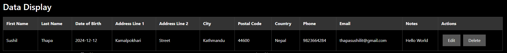

## Mern-Crud

# CSD-4553-02
The code base of the course CSD-3130-02 Full Stack JavaScript

# Mern Stack
This is a simple secure web application using MERN stack that allows users to manage the following data:
User Last Name, First Name, Date of Birth, Address1, Address2, City, Postal Code, Country, Phone-Number, Email and User Notes.

## Features

### Manages following data:
- Homepage
- Login
- CRUD
- Responsive

## Application Preview

Login Page

Add User

Display User

Update User


## Setup
1. Clone the repository:
   ```
   git clone https://github.com/sushilthapaIT/MERN-CRUD
   cd "Project Folder"
   ```

2. Install Project Dependencies:
   ```
   npm install
   ```

3. Set up your MongoDB credential and update the `.env` file with your access keys.

##### Set Up Instructions
To run the application, you have to create a ".env" file locally.
This file must include two variables called ```"MONGODB_USERNAME"``` and
```"MONGODB_PASSWORD"```.

4. Run the Application:
   ```
   npm start
   npm run dev
   ```

5. Access the Application
  Open your web browser and go to http://localhost:5000 (or the port you set in .env). You should see the home page of the application